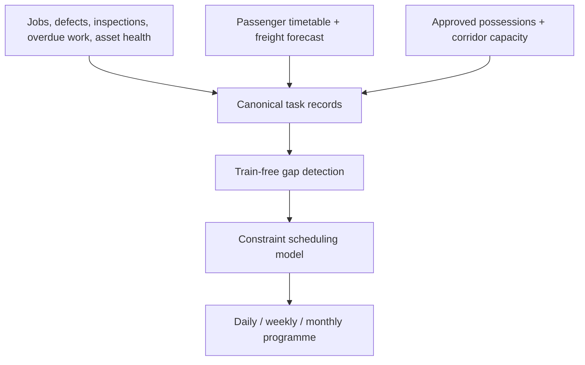

# Architecture Freeze

## System architecture

```mermaid
flowchart LR
  S[TMS / SMMS / TDMS / COA adapters] --> N[Normalization engine]
  N --> C[Canonical maintenance + timetable model]
  C --> T[Railway digital twin]
  T --> P[Hybrid priority engine]
  P --> G[Constraint generation]
  G --> O[OR-Tools CP-SAT]
  O --> V[Post-solve safety validator]
  V --> R[Robustness / simulation]
  R --> X[KPIs + explainability]
  X --> H[Human control-office review]
  H --> E[Execution feedback]
  E --> N
```



## Operational data flow



## Digital twin

The prototype twin is a graph of station nodes, four corridor sections and typed assets. The next production boundary is `digital_twin/`, where graph topology, occupancy events and simulation state remain separate from scheduling decisions. A future 3D renderer is visualization-only and cannot create a possession.

## Optimizer architecture

- Baseline: priority greedy, earliest feasible window.
- Production: CP-SAT optional interval variables, section and crew `NoOverlap`, train separation, deadlines and approved blocks.
- Validation: every returned block is checked again outside the solver before approval.
- Replanning: preserve prior assignments as hints and add churn penalties in the rolling-horizon objective.

## Mathematical model

For task $i$, `s_i` is start, `e_i = s_i + d_i`, and `y_i` is a scheduled Boolean. Each optional interval is active only when `y_i=1`.

Hard constraints:

- $0 \le s_i \le deadline_i - d_i$
- no overlapping intervals on a track section
- no overlapping intervals assigned to the same crew
- no overlap with a protected train plus configurable safety separation
- no overlap with approved fixed blocks
- all required tasks must remain within their deadline or be explicitly deferred

The objective maximizes weighted completion value:

$$\max \sum_i y_i(1000 + 10 \times priorityScore_i)$$

The production objective extends this with negative terms for downtime, train delay, block count, mobilization, overtime and schedule churn. Weight configuration belongs in YAML, not UI assumptions.

## Joint blocks

Compatible task classes share a possession only when section, safety isolation, department compatibility and resource requirements permit it. The block aggregation layer groups compatible intervals after solving and reports independent minutes versus shared minutes. Incompatible work remains separate.

## API and event model

REST: `/api/scenario`, `/api/tasks`, `/api/trains`, `/api/blocks`, `/api/optimization/run`, `/api/metrics/availability`, `/api/tasks/{id}/explanation`, `/api/joint-blocks`, `/api/replan`, `/api/simulation/state`, `/api/simulation/tick`, `/api/simulation/events`, `/api/health`.

Planned events: `optimization.progress`, `approval.changed`, `execution.updated`, `simulation.tick`, `scenario.replanned`. WebSocket delivery is an adapter boundary; the current local slice uses request/response.

## Repository tree

```text
backend/app/{main.py,models.py,synthetic.py,optimizer.py,kpi.py}
frontend/{index.html,styles.css,app.js}
requirements.txt
start.ps1 stop.ps1 start.sh stop.sh
```

## Security design

Production deployment requires OIDC/JWT or secure session auth, role checks for planner/control-office actions, password hashing through a maintained identity provider, audit records for inputs and approvals, strict upload validation, rate limiting, secret injection through environment variables, and default-deny CORS. The local demo intentionally has no authentication boundary and must not be exposed publicly.

## Resource budget

Demo target: 4 CPU cores, 8 GB RAM, no GPU. CP-SAT time limit is configurable. A production division-scale deployment partitions by corridor, coordinates boundary possessions, and uses PostgreSQL plus a job queue; one laptop process is not claimed to optimize a national network.
