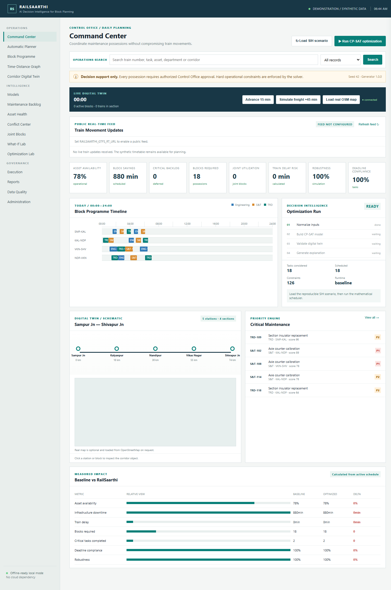
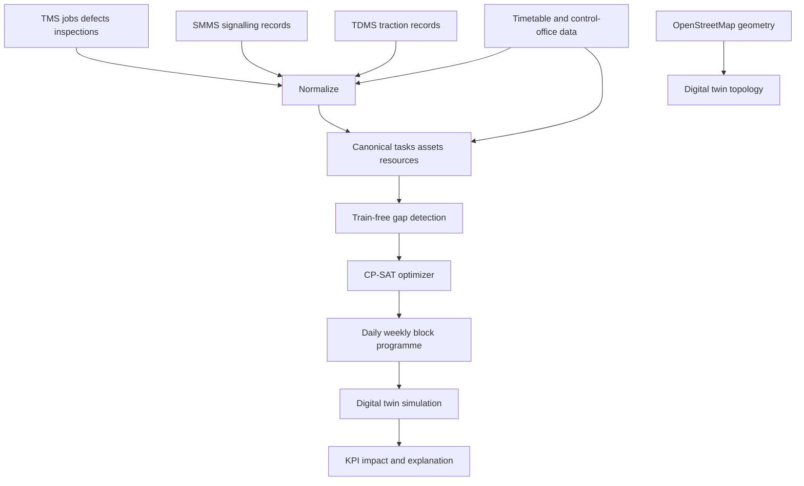
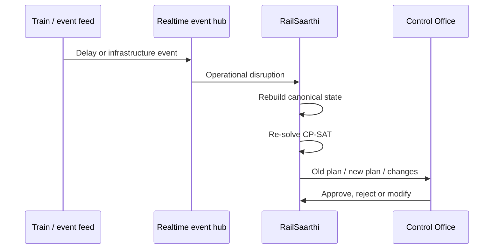
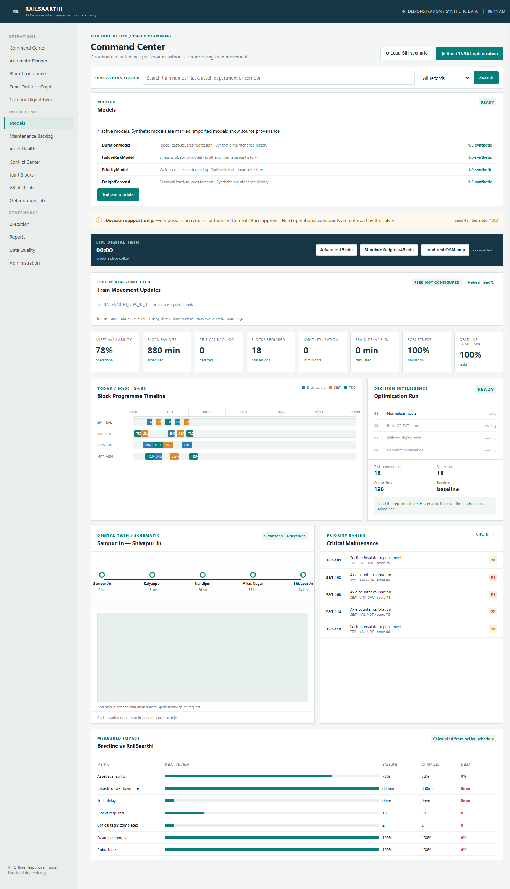
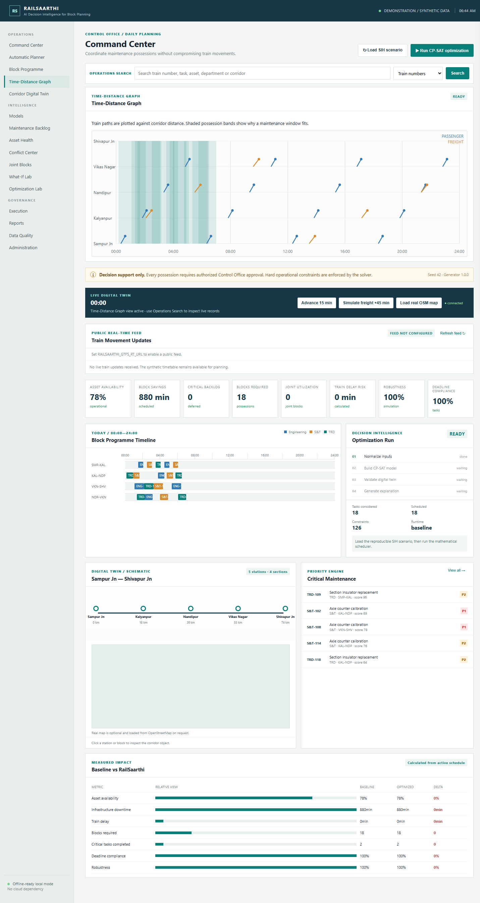
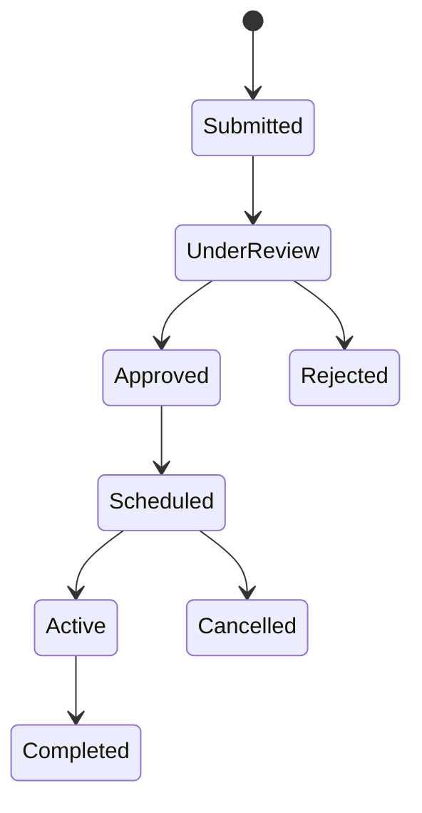

# RailSaarthi

> **Railway Intelligent Asset & Infrastructure Scheduling, Availability and Resilient Timetable Harmonization System**

RailSaarthi is a control-office decision-intelligence platform for coordinating railway maintenance possessions across Engineering, S&T and TRD while protecting train movements. It combines a deterministic safety layer, Google OR-Tools CP-SAT scheduling, explainable AI predictions, public-data adapters, digital-twin simulation and human approval workflow.

## Run locally

<p align="center">
	
</p>

## Executive Summary

| Capability | What RailSaarthi does | Safety posture |
|---|---|---|
| **Prioritization** | Ranks maintenance demand using safety risk, criticality, defect severity and operational impact | AI is advisory |
| **Scheduling** | Selects feasible possession windows using CP-SAT interval constraints | Hard constraints are deterministic |
| **Coordination** | Finds compatible Engineering + S&T + TRD joint-block opportunities | Compatibility rules are explicit |
| **Replanning** | Re-solves when a freight movement is delayed or a window changes | Previous and revised plans are comparable |
| **Validation** | Runs conflicts, quality checks and seeded robustness simulations | Invalid inputs are visible |
| **Explainability** | Shows why a task and time slot were selected | Alternatives and factors are inspectable |
| **Human control** | Supports request states, role permissions and Control Office approval | Software never authorizes a possession |

## The Engineering Idea

RailSaarthi separates three kinds of reasoning:

```text
Prediction       -> AI / statistical models
Allocation       -> Constraint programming / CP-SAT
Safety           -> Explicit hard operational constraints
```

This prevents a forecast, classifier or language model from overriding train separation, section exclusivity, deadlines, resource availability or approved blocks.

## Architecture

```mermaid
flowchart LR
		A[Public and railway adapters<br/>TMS SMMS TDMS COA OSM GTFS-RT] --> B[Normalization engine]
		B --> C[Canonical maintenance model]
		C --> D[Railway digital twin]
		D --> E[AI priority risk duration demand]
		E --> F[Constraint generation]
		F --> G[OR-Tools CP-SAT]
		G --> H[Post-solve validator]
		H --> I[Robustness simulation]
		I --> J[KPI and explainability]
		J --> K[Planner and Control Office review]
		K --> L[Approval execution feedback]
		L --> B
```



### Operational Data Flow



### Replanning Loop



## Mathematical Scheduling Model

For each maintenance task $i$, RailSaarthi creates an optional interval:

$$e_i = s_i + d_i$$

where $s_i$ is the start time, $d_i$ is duration, $e_i$ is completion time and $y_i$ indicates whether the task is scheduled.

### Hard constraints

| Constraint | Model behavior |
|---|---|
| Train protection | Maintenance cannot overlap a protected train movement plus separation buffer |
| Section exclusivity | Incompatible intervals on one section use `NoOverlap` |
| Crew availability | A crew cannot execute two simultaneous jobs |
| Deadlines | Scheduled completion cannot exceed the task deadline |
| Approved blocks | Existing fixed possessions are respected |
| Optional work | Deferrable tasks can remain unscheduled and are reported |
| Before/after logic | Tasks can fit before or after a protected movement |

The prototype objective maximizes weighted task completion value. The architecture supports additional terms for infrastructure downtime, passenger delay, freight disruption, block count, mobilization, overtime, backlog and schedule churn.

### Benchmark hierarchy

| Engine | Purpose | Status |
|---|---|---|
| Priority Greedy | Transparent baseline for comparison | Working |
| OR-Tools CP-SAT | Primary constrained scheduler | Working |
| Monte Carlo | Duration and disruption robustness | Working |
| Imported ML models | Advisory risk, priority, duration and demand | Working when records are supplied |
| GA / RL | Research extensions | Not used as the safety scheduler |

## AI Model Registry

<p align="center">
	
</p>

| Model | Input | Output | Current implementation |
|---|---|---|---|
| `DurationModel` | Task, risk, crew and isolation features | Duration and 95% interval | Least-squares regression |
| `FailureRiskModel` | Asset and defect risk features | Failure probability estimate | Linear probability model |
| `PriorityModel` | Safety, criticality and defect features | Priority score | Weighted regression |
| `FreightForecast` | Hour-of-day features | Expected freight demand | Seasonal regression |

The default local models use reproducible training history. Authorized railway records can be imported through `POST /api/railway-data/import`; the registry then records source authority, training time, record count and imported model version. No Indian Railway dataset is fabricated or bundled.

## Control-Office Screens

### Command Center

Shows asset availability, block programme, solver state, request search, live-feed status, digital twin controls, critical maintenance and measured baseline comparison.

### Time-Distance Graph

<p align="center">
	
</p>

The graph plots passenger and freight movements against corridor station distance. Possession bands show where maintenance occupies infrastructure and why a proposed interval fits between protected movements.

### Functional module workspace

| Module | Live behavior |
|---|---|
| Automatic Planner | Runs CP-SAT optimization |
| Block Programme | Opens the active timeline |
| Time-Distance Graph | Renders train paths and block bands |
| Corridor Digital Twin | Loads schematic and public map geometry |
| Maintenance Backlog | Lists requests and supports Control Office approval |
| Asset Health | Lists asset state and health |
| Conflict Center | Loads computed hard conflicts |
| Joint Blocks | Loads compatible opportunities and saved minutes |
| What-If Lab | Triggers freight-delay replanning |
| Optimization Lab | Runs the solver and exposes result state |
| Execution | Advances the digital-twin clock |
| Reports | Downloads the current block programme CSV |
| Data Quality | Shows validation rules and score |
| Models | Shows registry and retraining action |

## Request Workflow and Roles



| Role | Typical permissions |
|---|---|
| Administrator | View all, approve, reject, run optimizer, manage conflicts |
| Control Office | Approve, reject, freeze and review operational plans |
| Planner | Submit requests, run optimization, export reports |
| Engineering | Submit and review Engineering work |
| S&T | Submit and review signalling work |
| TRD | Submit and review traction work |
| Viewer | Read-only access |

Approval is enforced by the API. A Viewer cannot approve a request; Control Office and Administrator can.

## Public and Railway Data

### OpenStreetMap

The portal can fetch current public railway geometry from the OpenStreetMap Overpass API and render it with Leaflet. Attribution and fetch time are shown. OSM geometry is not a possession authority source.

### GTFS-Realtime

Configure an authorized direct protobuf feed:

```powershell
$env:RAILSAARTHI_GTFS_RT_URL="https://cdn.mbta.com/realtime/TripUpdates.pb"
```

The feed is decoded using `gtfs-realtime-bindings`. Trip updates, vehicle positions and alerts are shown as external observations. They are not silently converted into safe railway block permissions.

### Authorized Indian Railway training data

```json
{
	"source_name": "Authorized railway maintenance export",
	"source_url": "https://example.authority/record-source",
	"authority": "Data owner or approving authority",
	"synthetic": false,
	"records": [
		{
			"criticality": 4,
			"safety_risk": 3,
			"defect_severity": 3,
			"crew_size": 4,
			"machine": false,
			"power_isolation": false,
			"signal_disconnection": true,
			"duration_minutes": 60,
			"failure_label": 0
		}
	]
}
```

The API requires at least 10 validated records and retrains all four models with imported provenance.

## API Reference

| Method | Route | Purpose |
|---|---|---|
| `GET` | `/api/health` | Service health |
| `GET` | `/api/scenario` | Active canonical scenario |
| `POST` | `/api/scenario/load` | Refresh planning state |
| `GET` | `/api/search` | Train, task, asset and corridor search |
| `GET` | `/api/requests` | Filter maintenance requests |
| `PATCH` | `/api/requests/{id}` | Request status transition |
| `GET` | `/api/roles/permissions` | Role permission matrix |
| `POST` | `/api/optimization/run` | Run CP-SAT |
| `GET` | `/api/metrics/availability` | Baseline and optimized metrics |
| `GET` | `/api/joint-blocks` | Compatible shared possessions |
| `POST` | `/api/replan` | Disruption replanning |
| `POST` | `/api/what-if/traffic` | Re-solve freight-growth or passenger-delay scenario |
| `GET` | `/api/simulation/state` | Digital-twin snapshot |
| `POST` | `/api/simulation/tick` | Advance simulation |
| `GET` | `/api/conflicts` | Hard conflict report |
| `GET` | `/api/robustness` | Seeded robustness simulation |
| `GET` | `/api/models` | Model registry |
| `POST` | `/api/models/train` | Retrain models |
| `GET` | `/api/models/predict/{task_id}` | Task prediction |
| `POST` | `/api/railway-data/import` | Import authorized training records |
| `GET` | `/api/live/status` | Public-feed status |
| `GET` | `/api/export/blocks.csv` | Export block programme |
| `WS` | `/ws/events` | Progress and execution events |

## Quick Start

### Windows

```powershell
py -3 -m pip install -r requirements.txt
py -3 -m uvicorn backend.app.main:app --host 127.0.0.1 --port 8010
```

Open [http://127.0.0.1:8010](http://127.0.0.1:8010). `start.ps1` is also provided.

### Linux

```bash
python3 -m pip install -r requirements.txt
python3 -m uvicorn backend.app.main:app --host 127.0.0.1 --port 8010
```

### Docker

```bash
docker compose up --build
```

## Validation

```powershell
py -3 -m pytest tests -q
py -3 -m compileall backend
node --check frontend/app.js
```

The current suite covers deterministic scenario generation, baseline constraints, realtime workflow, freight-delay replanning, model training, imported-record prediction and role-based request approval.

## Repository Map

```text
backend/app/
	analytics.py       conflicts, quality and robustness
	integration.py     adapter contracts
	joint_blocks.py    compatibility rules
	kpi.py             calculated impact metrics
	live_data.py       OSM and GTFS-Realtime ingestion
	main.py            FastAPI application and routes
	ml.py              model training and registry
	optimizer.py       greedy and CP-SAT scheduling
	railway_data.py    authorized data import
	realtime.py        WebSocket event hub
	replanning.py      disruption recovery
	simulation.py      digital-twin state and events
	synthetic.py       reproducible fallback dataset
	workflow.py        requests, roles and approvals
frontend/
	index.html app.js styles.css
tests/
	test_optimizer.py
screenshots/
	command-center.png time-distance-graph.png model-registry.png
```

## Truth and Safety Boundaries

- The included corridor and maintenance records are fictional fallback data.
- Real Indian Railway records must be supplied by an authorized data owner.
- Public OSM geometry does not represent railway control authority.
- AI predictions cannot override hard constraints.
- Software recommendations require human Control Office approval.
- In-memory persistence is suitable for local demonstration, not production deployment.
- Production deployment requires authenticated users, durable audit logs, database persistence, secured adapters and operational certification.

## Project Status

RailSaarthi currently provides a working local vertical slice with CP-SAT scheduling, request approvals, digital-twin simulation, public map ingestion, optional GTFS-Realtime decoding, trained local models, explanations, replanning, screenshots and automated tests. See [ARCHITECTURE.md](ARCHITECTURE.md) and [PROJECT_STATE.md](PROJECT_STATE.md) for implementation status and verified limits.

## Attribution

OpenStreetMap data must retain [OpenStreetMap attribution](https://www.openstreetmap.org/copyright). External GTFS-Realtime and railway records remain subject to their respective provider licenses and access terms.
py -3 -m pip install -r requirements.txt
py -3 -m uvicorn backend.app.main:app --reload
```

Open `http://127.0.0.1:8000`. On Windows, `./start.ps1` installs dependencies and starts the service. The OpenAPI contract is at `/docs`.

## Working vertical slice

1. Load SIH DEMO SCENARIO with reproducible seed 42.
2. Inspect the generated corridor, train movements and maintenance backlog.
3. Review the priority-greedy baseline.
4. Run CP-SAT optimization with hard section, train, crew, deadline and approved-block constraints.
5. Compare calculated KPIs and inspect a task's priority and slot explanation.
6. Advance the digital-twin clock or trigger a 45-minute freight disruption from the live control strip.
7. Inspect joint-block opportunities, conflict diagnostics, data quality, Monte Carlo robustness and CSV export through the API.

## Public real-data mode

The **Load real OSM map** control fetches current public railway geometry from the OpenStreetMap Overpass API and renders it with Leaflet. The map displays source attribution and fetch time. This is real infrastructure geometry, not a claim that OpenStreetMap contains railway possession authority or live Indian Railways control data.

Optional GTFS-Realtime ingestion is enabled with `RAILSAARTHI_GTFS_RT_URL`. Install the decoder from `requirements.txt`, then use `/api/live/refresh?gtfs_url=...`. The feed must be a public, authorized GTFS-Realtime endpoint. GTFS updates are displayed as external observations and are not silently converted into safe block permissions. The optimizer continues to use the canonical validated timetable model until an operator-approved adapter maps the feed into it.

Public web data is an optional integration path. The deterministic synthetic scenario remains the offline fallback and is always labeled as demonstration data.

## Realtime and analytics routes

The local service exposes `/ws/events` for optimization, simulation and replan events, `/api/replan` for disruption recovery, `/api/simulation/state` and `/api/simulation/tick` for the digital twin, `/api/search?query=F-001&kind=trains` for train-number lookup, `/api/joint-blocks`, `/api/conflicts`, `/api/data-quality`, `/api/robustness`, `/api/integration/status`, and `/api/export/blocks.csv`.

## Request Workflow and Roles

The backlog is now a request workflow rather than a read-only list. `/api/requests` supports department, status and priority filters. `/api/requests/{request_id}` supports status transitions, while `/api/roles/permissions` exposes the permission matrix. Only `Control Office` and `Administrator` roles can approve or reject a request; planners and departments can inspect and submit work without bypassing operational approval.

## Local AI models

`/api/models/train` trains deterministic duration, failure-risk, priority, and freight-forecast models from seeded synthetic history. `/api/models` exposes registry metadata and validation metrics. `/api/models/predict/{task_id}` returns priority, risk, and duration interval estimates; `/api/models/freight-forecast` returns hourly demand estimates. These models provide prioritization and planning estimates only; CP-SAT hard safety constraints remain authoritative, and synthetic metrics are not production claims.

Authorized Indian Railway data can replace the synthetic training source with `POST /api/railway-data/import`. The payload requires `source_name`, `source_url`, `authority`, and at least 10 validated maintenance records containing criticality, safety risk, defect severity, crew size, duration, failure label, and isolation flags. After import, `/api/railway-data/statistics` reports source-backed aggregates and all four models are retrained with `1.0-imported` provenance. No Indian Railway operational dataset is bundled or invented in this repository.

## Data transparency

The demo corridor is fictional: Sampur Jn, Kalyanpur, Nandipur, Vikas Nagar and Shivapur Jn. Generated records contain `synthetic=true`, seed and generator version. Production adapters can later implement TMS, SMMS, TDMS, COA, timetable and goods forecast contracts without changing the optimizer model.

## Scope and limitations

The current runnable slice uses in-memory persistence and a 24-hour planning horizon. PostgreSQL, migrations, production authentication, live adapters, and 3D visualization remain deployment extensions. The request approval workflow, CP-SAT scheduling, digital-twin simulation and analytics are implemented locally. No safety authority is delegated to the software.
